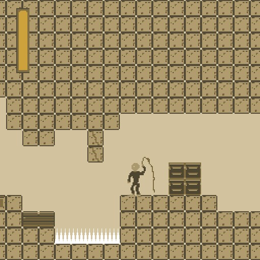

# Eelusion

Author: Sebastien Alaiwan

Demo
----

An online demo is available here:

http://code.alaiwan.org/games/eelusion

<p align="center"></p>

Description
-----------

This is a compo game for the LD45 game jam. The theme was "Start With Nothing".

It's a tiny castlevania-like game which can be compiled to native code,
or, using Emscripten, to asm.js (=javascript).

It uses SDL2, and the OpenGL ES2 3.0 profile.

This code also shows how to isolate game logic code (doors, switches,
powerups, bullets, ..) from I/O code (display, audio, input).

Directory structure
-------------------

```
bin:            output directory for architecture-specific executable binaries.
res:            output directory for game resources (e.g. sounds, music, sprites, tilesets).
res-src:        source files for game resources.
src:            source files for the game logic (agnostic to the engine implementation).
engine/src:     I/O code (=engine), mostly game-agnostic.
engine/include: interfaces for communication between the game logic and the I/O code. Also contains shared low-level utilities (e.g Vector2f, Span, etc.).
./check:        main check script. Call this to build native and asmjs versions and to launch the unit tests.
```


Build
-----

Requirements:
```
* libsdl2-dev
* libogg-dev
* libvorbis-dev
```

It can be compiled to native code using your native compiler (gcc or clang):

```
$ make
```

The binaries will be generated to a 'bin' directory
(This can be overriden using the BIN makefile variable).

It can also be compiled to Javascript, using Emscripten.
In theory, it's as simple as:

```
$ CXX=emcc make
```

However, in practice, more options need to be injected to the makefile,
like setting EXT (program extension) to ".html", etc.
There's a make wrapper that does exactly that:

```
$ ./scripts/asmjs-make
```

Run the game
------------

Just run the following command:

```
$ bin/rel/game.exe
```


Thanks to:
----------

- llexandro from DevianArt (Textures)

